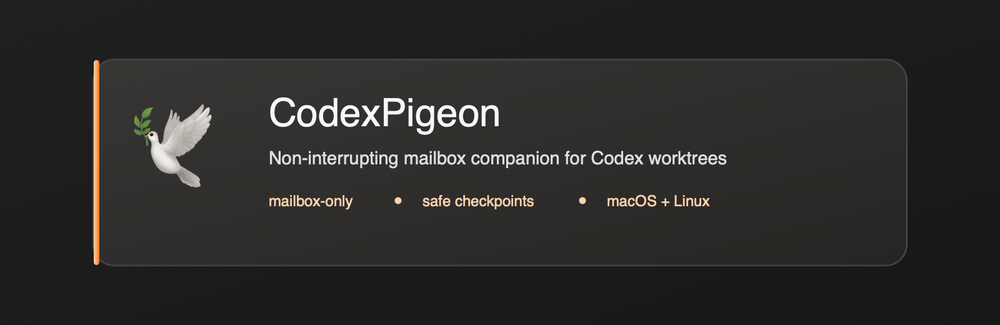
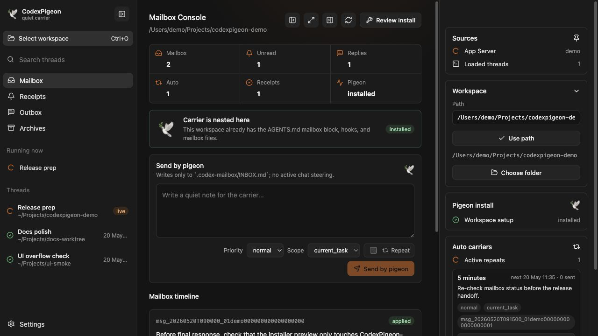

<p align="center">
  
</p>

<h1 align="center">CodexPigeon</h1>

<p align="center">
  Non-interrupting mailbox companion for Codex worktrees.
</p>

<p align="center">
  Built by <a href="https://github.com/ademisler">Adem Isler</a> · MIT licensed · macOS and Linux development builds
</p>

<p align="center">
  <a href="https://github.com/ademisler/codexpigeon/actions/workflows/ci.yml"></a>
  <a href="LICENSE"></a>
  
</p>

---

## What This Is

CodexPigeon lets a human leave repo-local guidance for a Codex task without
injecting into the active chat turn.

It gives each selected repo/worktree a `.codex-mailbox/` folder. The app and CLI
append human messages to `INBOX.md`; the Codex agent reads those messages at
safe checkpoints through installed project instructions and hooks, then writes
status back to agent-owned files.

The product invariant is strict:

- no active chat steering
- no chat message injection
- no turn interruption or turn start APIs
- no App Server write APIs
- no app writes to agent-owned `OUTBOX.md` or `RECEIPTS.md`

## Open Source

This repository is intended to be inspectable. The mailbox protocol is plain
Markdown, runtime files are repo-local, and all Codex App Server access is
restricted to read/status/discovery methods.

The current release is a working MVP for local macOS and Linux development.
Signed packages can be added later without changing the protocol.

## Screenshot

<p align="center">
  
</p>

The README screenshot is captured from demo mode with synthetic workspace paths
and synthetic mailbox content. It does not show private Codex state.

## What You Get

| Area              | Included                                                                                   |
| ----------------- | ------------------------------------------------------------------------------------------ |
| Desktop app       | Electron + React + Vite app with mailbox, receipts, outbox, install, and diagnostics views |
| CLI               | `codexpigeon doctor`, `install`, `send`, `watch`, `snapshot`, and automation commands      |
| Mailbox core      | Parser, serializer, installer, validation, file ownership, and repeat scheduling           |
| Codex integration | Read-only App Server client for thread and hook discovery                                  |
| Hooks             | Project-local hook runtime copied into trusted workspaces                                  |
| Templates         | Managed `AGENTS.md`, `.codex/hooks.json`, and `.codex-mailbox/` templates                  |
| Tests             | Mailbox behavior, installer boundaries, hook runtime, and App Server allowlist coverage    |

## The Result

| Without CodexPigeon                              | With CodexPigeon                                                           |
| ------------------------------------------------ | -------------------------------------------------------------------------- |
| You must interrupt an active chat to add context | You leave a mailbox note for the next safe checkpoint                      |
| Guidance can get mixed into conversational flow  | Guidance is stored as repo-local working state                             |
| Follow-up reminders are manual                   | Optional repeats append normal inbox messages while the app/CLI is running |
| App Server boundaries are easy to blur           | Mutating App Server methods are rejected by design                         |

## Quick Start: macOS

Requirements:

- Node.js 22+
- pnpm 11+
- Python 3 for installed project hooks
- Codex CLI/App Server for live thread discovery

```bash
pnpm install
pnpm typecheck
pnpm test
pnpm build
pnpm install:mac
```

This creates:

```text
~/.local/bin/codexpigeon
~/.local/bin/codexpigeon-desktop
/Applications/CodexPigeon.app     # preferred when /Applications is writable
~/Applications/CodexPigeon.app    # fallback when /Applications is not writable
```

Then run:

```bash
codexpigeon doctor
codexpigeon-desktop
```

## Quick Start: Development

Run the browser development shell:

```bash
pnpm dev
```

Open:

```text
http://127.0.0.1:5173/
```

Browser mode uses a Vite-local Node API and cannot open a native folder picker.
Type an absolute repo/worktree path in the right inspector.

Run the full Electron runtime:

```bash
pnpm --filter @codexpigeon/desktop dev:electron
```

Run sanitized demo mode for screenshots:

```text
http://127.0.0.1:5173/?demo=1
```

## CLI

During development:

```bash
pnpm --filter @codexpigeon/cli start -- doctor
pnpm --filter @codexpigeon/cli start -- install --workspace /path/to/worktree
pnpm --filter @codexpigeon/cli start -- send --workspace /path/to/worktree "Check the mailbox before final response."
pnpm --filter @codexpigeon/cli start -- send --workspace /path/to/worktree --repeat-every 5m "Please re-check the release gate."
pnpm --filter @codexpigeon/cli start -- watch --workspace /path/to/worktree
pnpm --filter @codexpigeon/cli start -- snapshot --workspace /path/to/worktree
pnpm --filter @codexpigeon/cli start -- automation list --workspace /path/to/worktree
pnpm --filter @codexpigeon/cli start -- automation stop --workspace /path/to/worktree auto_...
```

After `pnpm build`, the compiled CLI is exposed from
`packages/cli/dist/index.js` and from the local macOS wrapper installed by
`pnpm install:mac`.

## Workspace Install Behavior

Installing CodexPigeon into a repo/worktree creates or updates:

```text
AGENTS.md
.codex/hooks.json
.codex/hooks/codexpigeon_mailbox_hook.py
.codex-mailbox/README.md
.codex-mailbox/.gitignore
.codex-mailbox/INBOX.md
.codex-mailbox/STATE.json
```

Existing `AGENTS.md` content is preserved. CodexPigeon replaces only the managed
block between:

```md
<!-- CODEXPIGEON_MAILBOX_START -->
<!-- CODEXPIGEON_MAILBOX_END -->
```

Existing `.codex/hooks.json` files are parsed and merged. Non-CodexPigeon hook
groups are preserved.

Agent-owned files are not written by the app/CLI:

```text
.codex-mailbox/OUTBOX.md
.codex-mailbox/RECEIPTS.md
```

The installed hook creates those agent-owned files when Codex runs in the
trusted workspace, and snapshots treat missing agent-owned files as empty.

## Mailbox Rule

Each thread/worktree should have its own mailbox:

```text
1 thread = 1 worktree = 1 .codex-mailbox/
```

Ownership is strict:

| File              | Owner                             |
| ----------------- | --------------------------------- |
| `INBOX.md`        | App/CLI writes only               |
| `OUTBOX.md`       | Codex agent writes only           |
| `RECEIPTS.md`     | Codex agent writes only           |
| `STATE.json`      | App-owned technical state         |
| `HOOK_STATE.json` | Hook-owned throttle/runtime state |

See [Mailbox Protocol](docs/protocol.md) for message examples and status
derivation.

## Safety Boundary

CodexPigeon permits only these App Server methods:

- `initialize`
- `thread/list`
- `thread/read`
- `thread/loaded/list`
- `hooks/list`

The client rejects active-turn methods such as `turn/steer`, `turn/start`,
`thread/inject_items`, and `turn/interrupt`.

Mailbox content is treated as prompt-like human guidance, not executable shell
content.

## Documentation

| Document                                       | Purpose                                  |
| ---------------------------------------------- | ---------------------------------------- |
| [Architecture](docs/architecture.md)           | Package boundaries and data flow         |
| [Setup](docs/setup.md)                         | Local setup and development runtime      |
| [Mailbox Protocol](docs/protocol.md)           | Markdown file format and ownership rules |
| [Security Model](docs/security.md)             | Trust boundaries and review checklist    |
| [Development Guide](docs/development.md)       | Package workflow and checks              |
| [Troubleshooting](docs/troubleshooting.md)     | Common local issues                      |
| [Screenshots and Assets](docs/screenshots.md)  | Sanitized asset capture rules            |
| [Publishing Checklist](docs/publishing.md)     | GitHub release preparation               |
| [Release Checklist](docs/release-checklist.md) | Build, smoke test, and handoff steps     |
| [Platform Roadmap](docs/platform-roadmap.md)   | Packaging and platform plans             |
| [Design References](docs/design/references.md) | UI reference policy                      |

## Project Status

CodexPigeon is usable today for local macOS and Linux development. The next
packaging milestones are signed macOS builds, Linux desktop packages, and a
Windows packaging path after the mailbox protocol has more real-world mileage.
